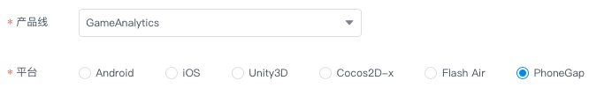

## TalkingData Game Analytics Cordova/PhoneGap SDK
Game Analytics Cordova/PhoneGap 平台 SDK 由`封装层`和 `Native SDK` 两部分构成，目前GitHub上提供了封装层代码，需要从 [TalkingData官网](https://www.talkingdata.com/spa/sdk/#/config) 下载最新版的 Android 和 iOS 平台 Native SDK，组合使用。

### 集成说明
1. 下载本项目（封装层）到本地；  
2. 访问 [TalkingData官网](https://www.talkingdata.com/spa/sdk/#/config) 下载最新版的 Android 和 iOS 平台 Game Analytics SDK（ Native SDK）
	- 方法1：选择 PhoneGap 平台进行功能定制；
	- 方法2：分别选择 Android 和 iOS 平台进行功能定制，请确保两个平台功能项一致；  
	
3. 将下载的最新版 `Native SDK` 复制到`封装层`中，构成完整的 Cordova SDK。  
	- Android 平台  
	将最新的 .jar 文件复制到 `Assets/Plugins/Android` 目录下
	- iOS 平台  
	将最新的 .a 文件复制到 `Assets/Plugins/iOS` 目录下
4. 按 `Native SDK` 功能选项对`封装层`代码进行必要的删减，详见“注意事项”第2条；
5. 将 Cordova SDK 集成您需要统计的工程中，并按 [集成文档](http://doc.talkingdata.com/posts/65) 进行必要配置和功能调用。

### 注意事项
1. 分别选择 Android 和 iOS 平台进行功能定制时，请确保两个平台功能项一致。
2. 如果申请 Native SDK 时只选择了部分功能，则需要在本项目中删除未选择功能对应的封装层代码。  
	a) 未选择`自定义事件`功能则删除以下5部分  
	删除 `www/TalkingDataGA.js` 文件中如下代码：
	
	```
		onEvent:function(eventId, eventData) {
			var eventDataJson = JSON.stringify(eventData);
			Cordova.exec(null, null, "TalkingDataGA", "onEvent", [eventId, eventDataJson]);
		},
	```
	删除 `src/android/TalkingDataGAPlugin.java` 文件中如下代码：
	
	```
			} else if (action.equals("onEvent")) {
				String eventId = args.getString(0);
				Map<String, Object> eventData = this.toMap(args.getString(1));
				TalkingDataGA.onEvent(eventId, eventData);
				return true;
	```
	```
		@SuppressWarnings("unchecked")
		private Map<String, Object> toMap(String jsonStr)
		{
			...
		}

	```
	删除 `src/ios/TalkingDataGAPlugin.h` 文件中如下代码：
	
	```
	- (void)onEvent:(CDVInvokedUrlCommand*)command;
	```
	删除 `src/ios/TalkingDataGAPlugin.m` 文件中如下代码：
	
	```
	- (void)onEvent:(CDVInvokedUrlCommand*)command {
		...
	}
	```
	```
	- (NSDictionary *)jsonToDictionary:(NSString *)jsonStr {
		...
	}
	```
	删除 `src/ios/TalkingDataGA.h` 文件中如下代码：
	
	```
	+ (void)onEvent:(NSString *)eventId eventData:(NSDictionary *)eventData;
	```
	b) 未选择`推送营销`功能则删除以下1部分  
	删除 `Assets/Plugins/iOS/TalkingData.h` 文件中如下代码：

	```
	+ (void)setDeviceToken:(NSData *)deviceToken;
	+ (BOOL)handleTDGAPushMessage:(NSDictionary *)message;
	```
	